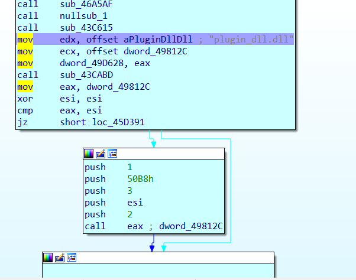

<body>
<h1 > IN PROGRESS </h1>
Before moving ahead , exploring the basic know-how of DLL files will be nice.
<h2>Dynamic Linked Lists</h2>
Simply put, dynamic linked libraries are external libraries which are needed by a program during run time. There are different kinds of DLL's and are treated differently by the operating system as such. The APP_INIT DLL's are known trusted DLL's which are loaded from the registry before <i>Any process</i> starts (Except the logon process) such as rundll32. The exploits related tp AppInit DLL require the corruption or manipulation of known dll's in the registry and will be covered in a later post.
<h2>How does a DLL work ? </h2>
Many functions may be called by the dll,some of which exportable. There is an optional main function which dll implements if it wants to do any startup activity. The things we can do within this Main function is very restrictive. To get a better hang of things let us load DLL may have other functions
An exe loads DLL from disk using LoadLibraryFunction , finds appropriate function by using GetProcAddress. These 2 functions are extremely important as we will see later. 
The 2 kinds of DLL's are as under.
<ul>
<li>
System DLL's : barebones basic functions that dll requires, winsock dll (eg Basic connection), kernel32 dll.
</li>
<li>Application DLL's : These are custom dll that ship with applications. We may have encountered common missing DLL while trying to load our favorite games.These DLL files are programmed by the developers of the application.
</li>
</ul>
The next thing to understand is how DLL's are loaded into a given program. 
If an exe is going through the process going with the function loader. Default DLL search order comes into play. It looks for the DLL. Safe DLL search came in from Windows XP SP2 onwards. when DLL hijacking became sort of rampant. This mechanism stops some DLL hijacking attacks but far from being exploit proof.
This blog on the microsoft website explains how a given DLL is searched. 
<a href="https://docs.microsoft.com/en-us/windows/desktop/Dlls/dynamic-link-library-search-order">MSDN Link</a>.  
<p>
<h2>
Loading meterpreter reverse shell from the infected DLL's using DLLMain?
</h2>
There is a custom stager of meterpreter for DLL written by Raphael Mudge which we can use. The code snippet for the DLLMain function is pasted below. It is a 64 bit version, which has been modified from the original 32 bit version. 

The full link for the code can be found here <a href="">
</a>
As an attacker, aim would be to create a reverse shell , connectg back to the attacker. Load the stage2 metasrv.dll and stdapi to spawn a full fledge meterpreter shell with stdapi. As we see however trying to do this fails. You can try this on your own, but the stage 2 of the meterpreter will not load as there are restrictions on the things we can do from <i>DLL Main</i>. See the stackoverflow blog for details
<a href="https://stackoverflow.com/questions/2674736/loading-a-dll-from-a-dll">Link</a>.
</p>

<p>
<h2>Alternative?</h2>
Since we have already estabilished that we cannot load the <i>metsrv.dll</i> from the DLL Main, what we can do is make the <i>victim program call our function which has the shellcode</i>. 
How do we do that? What are the prerequisites? Let us address each issue step by step. 
<br>
<ul>
<li>First we need a vulnerable software. Software that is vulnerable to DLL hijacking. For this demo we will use <b>uTorrent</b>. This can be downloaded from exploitdb at this <a href="https://www.exploit-db.com/exploits/14726">link</a>
</li>
<li>
	Suppose we don't know that plugin_dll is vulnerable, how do we figure out a list of DLL files which we want to target? We must target those DLL files which are not found by the program after going thorugh the search order, and then cause the dll file to be delivered on the same place where the executable is present. 
</li>
<li>
	To find out which DLL files a program is trying to load but can't we will use something called <b>ProcMon</b>(Download it here <a href="https://docs.microsoft.com/en-us/sysinternals/downloads/procmon">link</a>). You are free to use other tools which you deem fit. What we want to do here is to figure out which DLL's are not being requested but not found by the vulnerable uTorrent software.
</li>
<li>
	The screenshot below shows what ProcMon shows us. We need to setup filters where we feel that procmon
	After applying the filters we can see that the dll's which fail to load are :{}
</li>
<li>
	The key point is to identify DLL's which load after the uTorrrent has just loaded into the memory.SO not all missing DLL files are viable candidates. 
</li>
<li>
	utorrent.exe is packed with a packer called Upx. How did I get that information? Well, when you try to load it into IDA for analysis we get a message which lets us know it has been packed. Using a tool called "PE-Explorer" we can find out that the binary has been packed using UPX from the header. After we unpack it using-
	``` cmd
		upx -d uTorrent.exe
	```
</li>
<li>
	IDA is a popular disassembler for windows. The IDA is available in free and commercial versions. It can be downloaded from the IDA website.  The principles behind it however will remain the same. You need to know how to do basic stuff in the GUI such as insert a break point. Once this is done, Most of our work is done.

</li>
<li>
	We need to search for the vulnerable dll file which is "plugin_dll.dll" through the disassembly.Once this is done we identify the string in a non ".data" section, we identify the subroutine just after this. See the image below for reference.
	
</li>
</ul>
</p>


DLL hijacking will involve the delivery of the malicious DLL to the victim. There are a lot of ways to do this. It could involve a phishing link that downloads the DLL to the target application. There could be a malicious network share that could be used. If the malicious network share is being served by the attacker, the attacker completely bypasses the DLL load order and can completely exploit any application that is vulnerable to DLL hijacking. 


If you do not know how meterpreter works or loads shells, there is a good blog on rapid7 , the awesome developers of the famous pentesting tool , Metasploit. 
<a href="https://blog.rapid7.com/2015/03/25/stageless-meterpreter-payloads/"><Link</a>
I would cover how metasploit staging works, stageless payloads and staged payloads in a future blogpost regarding Metasploit. I am still a newbie at Metasploit, hence will blog about it when I have made quantifiable progress.
</body>