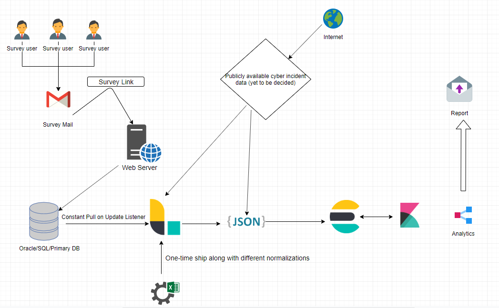

Elaborating below, some of the major areas that I have been working on in the last couple of years. I have also included any CTF's styled events that I have taken part in the last couple of years. I am still a year into infosec, and if you are someone who wants to work on something similar or different in technology/ infosec, shoot me an email or contact me at  **<a href="https://www.linkedin.com/in/yuvraj-singh-b29228a0/">LinkedIn</a>** or **<a href="https://github.com/reg1reg1">Github</a>** .

# CyberMetrics

Quantifying cyber risk is one of the biggest challenges in info sec today. Since the advent of the Orange book, people have been trying to quantify security or measure it in some form. Does the phrase "less" or "more secure" have any inference ? Though security may never be directly measured, can there be some metrics for it. There are various frameworks, and organizations such as PCI-DSS, NIST standards, BSIMM which focuses on software security.

This endeavour of cyber metrics done by the research team at NYU asks the question whether a reliable metrics of cyber metrics can be formed by asking the gut feeling of cybersecurity experts.

NYU's cyber metrics index of expert opinion or "gut feeling" on status of cyber security has been collecting opinion data over the last 8 years. This is an attempt to parse through and analyze the data with the ELK stack and conclude whether any corelations can be drawn between "gut feeling of experts" and "the actual state of cyber security".

A part of a team of 6 students in the Fall semester, working to find relation between various aspects of the data collected by survey started 8 years back by Dan Geer and Mukul Pareek. 

I worked on setting up the pipeline for pulling in the data, setting up a planned infrastructure for easier ingesting of data, and corelating the existing with various publicly available data related to cybersecurity breach, released CVE's to find patterns if any and aid in research work towards the technical paper on NYU's Cyber Index.

**<a href="https://github.com/reg1reg1/Metrics">Github Link to Project</a>**

# Implementing Network Security Monitoring

Network security is a complex process involving a lot of different micro components that need to be fine tuned to orchestrate a smooth, fast , adaptive and scalable implementation. For an organization to have a hardened NSM model, it must go through thorough and rigourous designs, redesigns and reviews before arriving at an optimal implementation. The dynamic nature of the threat that a network faces adds to the challenge of the task at hand, and an organization must either outsource or have a dedicated team of professionals in this area who are continously trained to maintain the NSM and modify it when the need be. The Application Collection Framework and Collective Intelligence frameworks are some which provide good reference points in setting up NSM for a given network. From deciding sensor hardware and placement, to deciding algorithms that detect threats faster, to building a scalable architecture that can adapt to changes well- A network security analyst is expected to know a vast array of skills proficiently.

Technologies Used:

1. Justniffer, Zeek for PTSR data extraction
2. YAF, SiLK (Cert NetSA tools) for flow collection and generation
3. GNS3 For Network Simulation
4. Security Onion as a reference Sensor
5. Bash scripts for various tasks such as monitoring, logging, and miscellaneous other automations
6. Filebeat for shipping logs
7. FRR as router software
8. Application Collection Framework /Collection Intelligence Framework as guidance
9. Logstash for centrally collecting and transferring logs
10. Elasticsearch for distributed storage of logs.
11. Kibana for visual analysis of logs.
12. Ansible for managing multiple nodes in the network
13. Python for automation.

The full project can be found here:> 
The whitepaper on the same can be found here:> 

